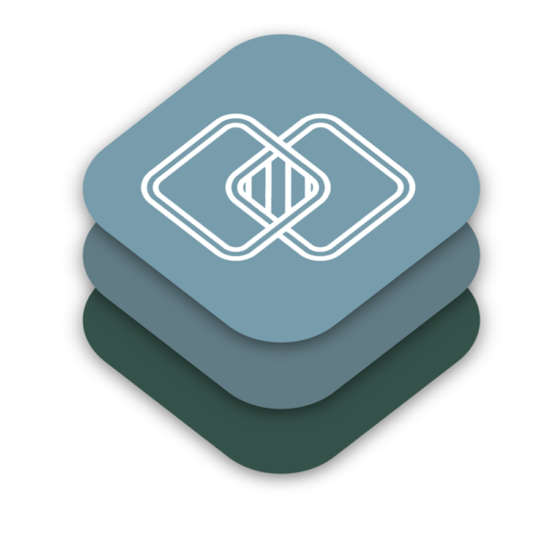

# Shared Graphics Tools

[](https://swift.org/platforms/)
[](https://swift.org)

<p align="left">
    
</p>

## Description

SharedGraphicsTools provides a convenient way to share graphics memory between different APIs on Apple platforms. This library helps [ZERO10](https://zero10.ar) to reduce memory traffic in its computer vision pipelines.

## Usage

### Reinterpret Graphics Data

This library introduces a `GraphicsDataProvider` protocol. Every type that conforms to it allows to make a view of its contents as:

- `vImage_Buffer`
- `CVPixelBuffer`
- `MLMultiArray`
- `MTLBuffer`
- `MTLTexture`

By default, these types are `vImage_Buffer`, `CGContext`, `CGImage`, `CVPixelBuffer`, `IOSurface`, `MTLTexture`, and `UIImage`.

That means it is possible to create an `IOSurface` and reinterpret its contents, such as `CVPixelBuffer` or `vImage_Buffer`.

```swift
let vImageBuffer: vImage_Buffer = try ioSurface.vImageBufferView()
let pixelBuffer: CVPixelBuffer = try vImageBuffer.cvPixelBufferView(cvPixelFormat: .type_32BGRA)
let texture: MTLTexture = try vImageBuffer.mtlTextureView(
    device: context.device,
    pixelFormat: .bgra8Unorm,
    usage: [.shaderRead, .shaderWrite]
)
```

This is quite handy as it allows for the reduction of boilerplate code as well as memory copy operations.

### Page-aligned Memory Buffer

In some cases, it is impossible to make an `MTLBuffer` or `MTLTexture` view on some graphics data as it is [requires the allocation pointer of the data to be page-aligned](https://developer.apple.com/documentation/metal/mtldevice/1433382-makebuffer). This requirement is done because internally, before the creation of `MTLBuffer`, Metal marks certain memory pages as accessible to GPU, and the shared memory address beginning should align with the page address.

To overcome such situations, `MTLSharedGraphicsBuffer` is provided. Inside, this class encapsulates the allocation of page-aligned memory and initialises an `MTLBuffer`, `MTLTexture`, `vImage_Buffer`, `CVPixelBuffer` and `CGContext` in such a way so they look at the same memory.

Given that, you can do such tricks as combining `CoreGraphics` rendering with `Metal` without memory transfers:

```swift
let context = try MTLContext()

let sharedBuffer = try MTLSharedGraphicsBuffer(
    device: context.device,
    width: 600,
    height: 600,
    pixelFormat: .bgra8Unorm
)

let rect = CGRect(
    x: 125,
    y: 125,
    width: 300,
    height: 300
)
let whiteColor = CGColor(
    red: 1,
    green: 1,
    blue: 1,
    alpha: 1
)

// Draw with CoreGraphics
sharedBuffer.cgContext.setFillColor(whiteColor)
sharedBuffer.cgContext.fill(rect)

// Continue with Metal
try context.schedule { commandBuffer in
    someFancyMetalFilter.encode(
        source: sharedBuffer.texture,
        destination: resultTexture,
        in: commandBuffer
    )
}
```

## License

`SharedGraphicsTools` is licensed under [MIT license](LICENSE).
